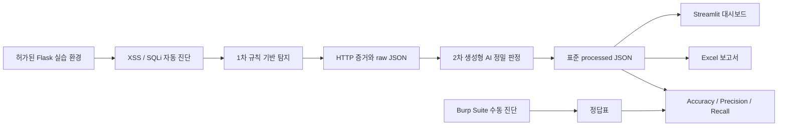

# AI-Triage Shield

> 생성형 AI 기반 2단계 트리아지 웹 취약점(XSS·SQL Injection) 자동 진단 플랫폼

**Team Lucky Seven · 럭키세븐**

AI-Triage Shield는 AWS에 의도적으로 취약한 실습용 웹 애플리케이션을 구축하고, **1차 규칙 기반 탐지(느슨함, 오탐 허용)**와 **2차 생성형 AI 정밀 판정**을 결합해 XSS·SQL Injection 취약점을 자동 진단하는 교육용 프로젝트입니다. 진단 결과는 표준 JSON으로 통합하여 Streamlit 대시보드와 Excel 보고서로 제공합니다.

> [!WARNING]
> 이 프로젝트는 팀이 직접 구축하거나 명시적으로 허가받은 격리 환경에서만 사용합니다. 외부 서비스와 허가받지 않은 시스템에는 절대 실행하지 마세요.

## 프로젝트 기획서

| 항목 | 내용 |
| --- | --- |
| 프로젝트명 | AI-Triage Shield |
| 팀명 | 럭키세븐 |
| 주제 | 생성형 AI 기반 2단계 트리아지 웹 취약점(XSS·SQL Injection) 자동 진단 플랫폼 |
| 대상 환경 | AWS에 구축한 의도적으로 취약한 격리형 실습 웹 애플리케이션 |
| 판정 방식 | 느슨한 1차 규칙 기반 탐지 후 생성형 AI로 정밀 판정 |
| 결과물 | 표준 JSON, Streamlit 대시보드, Excel 보고서 |

로그인·검색·게시판 등 실제 서비스와 유사한 기능에 취약 페이지와 방어 페이지를 함께 구축합니다. XSS와 SQL Injection 진단에는 동일한 2단계 판정 원칙을 적용하되, SQL Injection은 팀이 정한 정적 페이로드를 사용하고 XSS는 생성형 AI가 만든 페이로드를 검토·고정하여 재현성을 확보합니다. 최종 결과는 대시보드와 보고서에서 한눈에 확인할 수 있도록 구성합니다.

## 핵심 목표

1. XSS·SQL Injection 취약/안전 비교 웹 애플리케이션을 AWS에 구축·배포합니다.
2. **느슨한 1차 규칙 기반 탐지 + 정밀한 2차 AI 판정** 자동화 파이프라인을 완성합니다.
3. Burp Suite 수동 진단을 정답표로 삼아 Accuracy·Precision·Recall을 산출하고, SQLi 정적 페이로드 방식과 XSS AI 생성 방식을 탐색적으로 비교합니다.
4. 진단 결과를 Streamlit 대시보드와 Excel 보고서로 자동 시각화·리포팅합니다.

## 진단 전략



- 로그인·검색·게시판 등 실제 서비스와 유사한 기능에 취약 버전과 보안 조치가 적용된 버전을 함께 구성합니다.
- SQL Injection은 팀이 검토한 **정적 페이로드 목록**을 사용합니다.
- XSS는 생성형 AI가 만든 페이로드를 검토한 뒤 **버전을 고정**하여 재현성과 안전성을 확보합니다.
- 두 진단 모두 공통 Finding 스키마와 동일한 2단계 판정 원칙을 적용합니다.
- 사람이 만든 `ground_truth_label`은 AI 입력에서 제외하고 최종 평가에서만 사용합니다.

## 주요 기능

- Flask 기반 XSS·SQLi 취약/방어 실습 환경
- `requests` 및 Playwright/Selenium 기반 자동 진단과 증거 수집
- 규칙 기반 1차 판정 및 OpenAI 기반 2차 보조 판정
- Burp Suite 수동 진단 결과와 자동 판정 비교
- Streamlit·Plotly 기반 결과 대시보드
- pandas·openpyxl 기반 Excel 보고서 생성

## 기술 스택

| 영역 | 기술 |
| --- | --- |
| 웹 환경 | HTML, CSS, JavaScript, Python, Flask, MySQL, Docker |
| AWS | VPC, EC2, RDS, S3 |
| 자동 진단 | requests, pandas, Playwright/Selenium, Burp Suite |
| AI 판정 | OpenAI API |
| 시각화·보고 | Streamlit, Plotly, openpyxl |
| 테스트·품질 | pytest, Ruff |

## 팀 구성

| 이름 | 담당 |
| --- | --- |
| 김용성 | 취약한 페이지 환경 구축 |
| 김준영 (조장) | SQL Injection 자동화 |
| 류하영 | XSS 자동화 |
| 박종하 | 취약한 페이지 환경 구축 |
| 송승준 | 대시보드 구현 |
| 이승현 | 대시보드 구현 |

## 프로젝트 구조

```text
.
├── analysis/              # 데이터 모델, 프롬프트, AI 보조 판정
├── configs/               # 진단 대상 등 공유 가능한 설정 예시
├── dashboard/             # Streamlit UI, 통계, Excel 보고서
├── data/
│   ├── raw/               # 스캐너 원시 결과 (Git 제외)
│   ├── processed/         # AI 분석 완료 결과 (Git 제외)
│   └── exports/           # 생성된 Excel 보고서 (Git 제외)
├── docs/                  # 아키텍처 문서
├── lab_app/               # 격리된 Flask 실습 웹앱
├── scanners/              # XSS·SQLi 스캐너와 공통 로직
├── tests/                 # 자동화 테스트
├── main.py                # 로컬 통합 실행 진입점
└── requirements.txt
```

## 시작하기

### 1. 개발 환경 준비

Python 3.11 이상을 권장합니다.

```bash
python3 -m venv .venv
source .venv/bin/activate
python -m pip install --upgrade pip
pip install -r requirements.txt
```

### 2. 환경 변수 설정

로컬 `.env` 파일에 `OPENAI_API_KEY`와 `OPENAI_MODEL`을 설정합니다. 현재 저장소에는 `.env.example`이 포함되어 있지 않습니다. API 키, 비밀번호, 세션 키, AWS 계정 정보, 고정 IP, 개인정보가 포함된 원본 응답은 커밋하지 않습니다.

### 3. 실습 웹앱 실행

```bash
flask --app lab_app.app run --debug
```

### 4. 통합 진단 실행 예정 인터페이스

```bash
python main.py --targets configs/targets.example.json
```

현재 `main.py`는 대상 설정 경로만 확인하는 골격이며 스캐너·AI 처리·결과 저장은 아직 실행하지 않습니다.

### 5. 대시보드 실행

```bash
streamlit run dashboard/app.py
```

기본 실행 시 계약 v1 샘플 결과를 자동으로 불러옵니다. 사이드바에서 processed JSON과 SQLi ground-truth JSON을 업로드할 수 있으며, 결과 검토·필터·차트·조건부 평가와 Excel 초안 다운로드를 제공합니다. 목표 파이프라인은 [`docs/project-flow.md`](docs/project-flow.md), 팀 간 데이터 규격은 [`docs/data-contracts-v1.md`](docs/data-contracts-v1.md)를 참고하세요.

## 협업 규칙

- 통합 브랜치: `develop`
- 기능 브랜치: `feature/*`
- 기능 단위 Pull Request 사용
- PR 전에 `pytest`와 `ruff check .` 실행
- `.env`, 진단 원본, 생성 보고서, DB 파일은 커밋 금지

## 현재 상태

계약 v1 Pydantic 모델과 샘플 기반 Streamlit 결과 검토·통계·조건부 평가·Excel 초안 기능이 구현되어 있습니다. XSS·SQLi 스캐너, OpenAI 분석과 `main.py` 통합 파이프라인은 아직 골격 단계이며 각 담당 브랜치에서 개발합니다.
