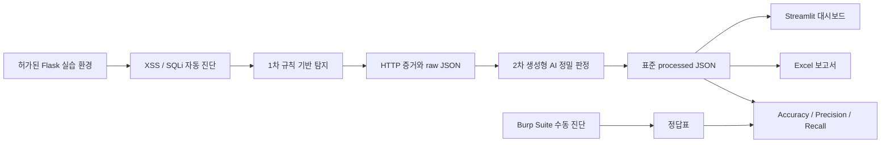

# AI-Triage Shield

> 생성형 AI 기반 2단계 트리아지 웹 취약점(XSS·SQL Injection) 자동 진단 플랫폼

**Team Lucky Seven · 럭키세븐**

AI-Triage Shield는 AWS에 의도적으로 취약한 실습용 웹 애플리케이션을 구축하고, **1차 규칙 기반 탐지(느슨함, 오탐 허용)**와 **2차 생성형 AI 정밀 판정**을 결합해 XSS·SQL Injection 취약점을 자동 진단하는 교육용 프로젝트입니다. 진단 결과는 표준 JSON으로 통합하여 Streamlit 대시보드와 Excel 보고서로 제공합니다.

> [!WARNING]
> 이 프로젝트는 팀이 직접 구축하거나 명시적으로 허가받은 격리 환경에서만 사용합니다. 외부 서비스와 허가받지 않은 시스템에는 절대 실행하지 마세요.

## 프로젝트 기획서

| 항목 | 내용 |
| --- | --- |
| 프로젝트명 | AI-Triage Shield |
| 팀명 | 럭키세븐 |
| 주제 | 생성형 AI 기반 2단계 트리아지 웹 취약점(XSS·SQL Injection) 자동 진단 플랫폼 |
| 대상 환경 | AWS에 구축한 의도적으로 취약한 격리형 실습 웹 애플리케이션 |
| 판정 방식 | 느슨한 1차 규칙 기반 탐지 후 생성형 AI로 정밀 판정 |
| 결과물 | 표준 JSON, Streamlit 대시보드, Excel 보고서 |

로그인·검색·게시판 등 실제 서비스와 유사한 기능에 취약 페이지와 방어 페이지를 함께 구축합니다. XSS와 SQL Injection 진단에는 동일한 2단계 판정 원칙을 적용하되, SQL Injection은 팀이 정한 정적 페이로드를 사용하고 XSS는 생성형 AI가 만든 페이로드를 검토·고정하여 재현성을 확보합니다. 최종 결과는 대시보드와 보고서에서 한눈에 확인할 수 있도록 구성합니다.

## 핵심 목표

1. XSS·SQL Injection 취약/안전 비교 웹 애플리케이션을 AWS에 구축·배포합니다.
2. **느슨한 1차 규칙 기반 탐지 + 정밀한 2차 AI 판정** 자동화 파이프라인을 완성합니다.
3. Burp Suite 수동 진단을 정답표로 삼아 Accuracy·Precision·Recall을 산출하고, SQLi 정적 페이로드 방식과 XSS AI 생성 방식을 탐색적으로 비교합니다.
4. 진단 결과를 Streamlit 대시보드와 Excel 보고서로 자동 시각화·리포팅합니다.

## 진단 전략



- 로그인·검색·게시판 등 실제 서비스와 유사한 기능에 취약 버전과 보안 조치가 적용된 버전을 함께 구성합니다.
- SQL Injection은 팀이 검토한 **정적 페이로드 목록**을 사용합니다.
- XSS는 생성형 AI가 만든 페이로드를 검토한 뒤 **버전을 고정**하여 재현성과 안전성을 확보합니다.
- 두 진단 모두 공통 Finding 스키마와 동일한 2단계 판정 원칙을 적용합니다.
- 사람이 만든 `ground_truth_label`은 AI 입력에서 제외하고 최종 평가에서만 사용합니다.

## 주요 기능

- Flask 기반 XSS·SQLi 취약/방어 실습 환경
- `requests` 및 Playwright/Selenium 기반 자동 진단과 증거 수집
- 규칙 기반 1차 판정 및 OpenAI 기반 2차 보조 판정
- Burp Suite 수동 진단 결과와 자동 판정 비교
- Streamlit·Plotly 기반 결과 대시보드
- pandas·openpyxl 기반 Excel 보고서 생성

## 기술 스택

| 영역 | 기술 |
| --- | --- |
| 웹 환경 | HTML, CSS, JavaScript, Python, Flask, MySQL, Docker |
| AWS | VPC, EC2, RDS, S3 |
| 자동 진단 | requests, pandas, Playwright/Selenium, Burp Suite |
| AI 판정 | OpenAI API |
| 시각화·보고 | Streamlit, Plotly, openpyxl |
| 테스트·품질 | pytest, Ruff |

## 팀 구성

| 이름 | 담당 |
| --- | --- |
| 김용성 | 취약한 페이지 환경 구축 |
| 김준영 (조장) | SQL Injection 자동화 |
| 류하영 | XSS 자동화 |
| 박종하 | 취약한 페이지 환경 구축 |
| 송승준 | 대시보드 구현 |
| 이승현 | 대시보드 구현 |

## 프로젝트 구조

```text
.
├── analysis/              # 데이터 모델, 프롬프트, AI 보조 판정
├── configs/               # 진단 대상 등 공유 가능한 설정 예시
├── dashboard/             # Streamlit UI, 통계, Excel 보고서
├── data/
│   ├── raw/               # 스캐너 원시 결과 (Git 제외)
│   ├── processed/         # AI 분석 완료 결과 (Git 제외)
│   └── exports/           # 생성된 Excel 보고서 (Git 제외)
├── docs/                  # 아키텍처와 팀 문서
├── lab_app/               # 격리된 Flask 실습 웹앱
├── scanners/              # XSS·SQLi 스캐너와 공통 로직
│   ├── xss.py             # 공개 진입점: scanners.xss.scan (main.py가 찾는 경로)
│   ├── base.py            # 공용 HTTP 헬퍼(같은 호스트로만 리다이렉트 추적 등)
│   ├── payload_cache.py   # payload_profile별 페이로드 캐시 파일 입출력(순수 I/O)
│   ├── payload_profiles.py # 런타임 스캐너용 payload_profile 로더 (OpenAI 호출 없음)
│   ├── tools/
│   │   └── generate_xss_payload_profile.py  # AI 페이로드 생성(사람이 직접 실행하는 오프라인 도구)
│   ├── xss_rules.py       # 반사 여부 내부 판정 로직
│   ├── xss_report.py      # 내부 판정 -> canonical RawFinding 조립 + sidecar 저장
│   └── pipeline/
│       └── xss.py         # scan(targets, context, on_progress)의 실제 구현
├── tests/                 # 자동화 테스트
├── main.py                # 로컬 통합 실행 진입점
└── requirements.txt
```

## 시작하기

### 1. 개발 환경 준비

Python 3.11 이상을 권장합니다.

```bash
python3 -m venv .venv
source .venv/bin/activate
python -m pip install --upgrade pip
pip install -r requirements.txt
```

### 2. 환경 변수 설정

로컬 `.env` 파일에 `OPENAI_API_KEY`와 `AI_TRIAGE_MODEL`을 설정합니다. 현재 저장소에는 `.env.example`이 포함되어 있지 않습니다. API 키, 비밀번호, 세션 키, AWS 계정 정보, 고정 IP, 개인정보가 포함된 원본 응답은 커밋하지 않습니다.

AI triage는 검증된 공식 문서 manifest, SHA-256이 고정된 로컬 OWASP·KISA 원문,
사람이 검토한 family grounding pack이 모두 준비되어야 실행됩니다.
`data/cache/grounding-packs.json`은 비공개로 배포하고 exact file SHA-256을
`AI_GROUNDING_PACK_SHA256`에 설정합니다. Runtime은 File Search에 의존하지 않으며
pack·manifest·원문 hash가 하나라도 맞지 않으면 사전점검을 차단합니다.

```text
RawRun 1.0
  → analysis.ai_triage.triage(raw_run, on_progress)
  → ProcessedRun 1.1
```

AI 후보는 reviewed family pack을 기본 근거로 사용하고, exact cache 또는
SHA-256 검증 로컬 공식문서 검색으로 보강합니다. 최대 16건씩 동시성 3으로 compact
보조 분류하며 정상 cold-cache 193건은 File Search 없이 structured synthesis
13회로 처리합니다. AI는 label·confidence·관찰·guidance ID를 반환하고 C2 영향,
C3 권고, C4 수동 검증 문장은 reviewed template에서 결정적으로 조립합니다.

AI는 최종 승인자가 아니라 2차 보조 분류기입니다. 실제 검색 결과·citation·manifest가 일치하는 `GROUNDED` 결과에서만 `VULNERABLE`, `SAFE`, `INCONCLUSIVE`와 confidence를 생성하며, 모든 결과는 사람 검토가 필요합니다. OWASP·KISA 문서는 판단 기준과 완화 지침이며 대상 시스템에서 취약점이 실행됐다는 증거가 아닙니다. 공식 판단 기준 문서가 부족하면 `INSUFFICIENT`·`INCONCLUSIVE`로 기록하고 권고·보고서 문장을 생성하지 않습니다.

### 3. 실습 웹앱 실행

실제로 XSS 취약점이 있는 실습 앱은 이 브랜치가 아니라 별도 브랜치에 있습니다(이 브랜치의 `lab_app/`은 `/health`만 있는 자리표시자 스켈레톤입니다).

| 환경 | 브랜치 | 앱 폴더 | 기본 주소 |
| --- | --- | --- | --- |
| 1번 (Lumi Market) | `feature/vulnerable-lab` | `lab_app/` | `http://127.0.0.1:5001` (`LAB_1_PORT`) |
| 2번 (NovaStream) | `feature/vulnerable-lab-2` | `lab_app_2/` | `http://127.0.0.1:5000` (`LAB2_PORT`) |

로컬에서 확인하려면(이 브랜치는 그대로 두고, 별도 워크트리로 체크아웃):

```bash
git worktree add ../vulnerable-lab-1 origin/feature/vulnerable-lab
cd ../vulnerable-lab-1 && pip install -r lab_app/requirements.txt
python -m lab_app.app   # http://127.0.0.1:5001
```

```bash
git worktree add ../vulnerable-lab-2 origin/feature/vulnerable-lab-2
cd ../vulnerable-lab-2 && pip install -r lab_app_2/requirements.txt
python -m lab_app_2.app   # http://127.0.0.1:5000
```

두 환경 모두 지금은 로컬에서 돌리지만 이후 서버에 배포될 예정입니다. 통합 실행은
registry에서 허가·재검증한 대상 주소만 `ScanContext.base_url`로 스캐너에 전달합니다.

### 4. 등록 대상 통합 진단 실행

```bash
python main.py run \
  --target-set-id novastream-2 \
  --deployment-id novastream-aws-mysql-v1 \
  --types XSS SQLI
```

진단 케이스는 `configs/target-registry.json`에 등록합니다. 실제 구축환경 주소는
환경구축팀이 비공개로 전달한 Deployment Descriptor JSON을 대시보드의
`배포환경 관리`에서 업로드합니다. 대시보드는 `/health` identity를 검증한 뒤
Git에서 제외된 `configs/deployments.local.json`에 등록하고, 허가된 deployment만
`ScanContext.base_url`로 전달합니다. MVP는 public 또는 loopback literal IP origin만
허용하며 실행 화면에는 임의 URL 입력을 제공하지 않습니다.

### 4-1. 파이프라인용 XSS 스캐너 (`scanners.xss.scan`)

`main.py`(통합 담당)의 `orchestration.PipelineOrchestrator`가 실제로 호출하는 진입점입니다. 시그니처는 팀 실행 계약이 정의한 대로입니다.

```python
def scan(targets: list[TargetCase], context: ScanContext, on_progress: ProgressCallback) -> list[RawFinding]:
```

`scanners/xss.py`는 실제 구현이 있는 `scanners/pipeline/xss.py`의 `scan`을 그대로 재수출합니다. `ScanContext`는 `orchestration` 패키지(통합 담당 소유, `feature/dashboard-contracts`)가 제공하며 `scan_run_id`, registry에서 재검증된 `base_url`, `request_policy`(timeout·redirect 정책), `responses_dir`, `resolve_auth_profile()`을 담고 있습니다. 이 스캐너는 파일 경로나 호스트를 스스로 계산하지 않고 전부 `context`에서 받습니다.

각 실습 환경에서 **실제로 XSS 취약점이 확인된 페이지·입력칸만** 대상으로 하며, 페이로드를 어느 파라미터에 넣어야 하는지는 타겟 매니페스트 JSON에 정확히 명시되어 있습니다.

| 환경 | target_set_id | 매니페스트 | 케이스 |
| --- | --- | --- | --- |
| 1번 (Lumi Market) | `lumi-market-1` | `configs/lumi_market_1_targets.example.json` | XSS: `GET /search`, `POST /reviews` · SQLi: `POST /account/login`, `GET /products/stock`, `GET /coupon/check` |
| 2번 (NovaStream) | `novastream-2` | `configs/novastream_2_targets.example.json` | XSS: `GET /discover`, `POST /titles/1/reviews` · SQLi: `GET /catalog`, `POST /login` |

두 매니페스트 모두 `configs/target-registry.json`에 등록되어 있습니다. manifest의
로컬 주소는 진단 케이스 예시이며, 실제 실행 주소는 검증된 deployment가 덮어씁니다.

**런타임 페이로드는 검토된 checked-in profile입니다.** 실행 계약은 "런타임
스캐너는 OpenAI API를 호출하지 않는다"고 명시합니다. 따라서 런타임은
`configs/payload-profiles/xss-v1.json`처럼 버전 관리되는 `reviewed-static`
profile만 읽습니다. 각 `payload_case_id`와 payload의 순서는 profile에 명시되어
있어 매니페스트를 다시 실행해도 바뀌지 않습니다.

AI 생성 도구는 오프라인에서 검토 후보를 만드는 용도일 뿐이며 런타임 source가
아닙니다.

```bash
python -m scanners.tools.generate_xss_payload_profile --profile xss-v1 --count 100
```

이 명령의 결과는 Git 제외 후보 cache에만 저장됩니다. **후보를 검토한 뒤에는
stable descriptive `payload_case_id`를 부여하여
`configs/payload-profiles/<profile>.json`의 versioned reviewed profile을 명시적으로
갱신**해야 합니다. 후보 cache는 scanner가 읽지 않습니다.

런타임 스캐너(`scanners/payload_profiles.py`)는 checked-in profile이 없으면
`PayloadProfileMissingError`를, profile이 손상됐거나 계약과 다르면
`PayloadProfileInvalidError`를 던지고 멈춥니다. AI를 대신 호출하거나 임의 값으로
조용히 계속 실행하지 않습니다.

XSS 스캐너에는 임의 manifest나 `base_url`을 받는 독립 실행 경로가 없습니다.
`main.py`가 registry에서 허가된 manifest를 해석한 뒤 `scanners.xss.scan`을
호출하며, 허가된 `base_url`과 요청 정책·응답 디렉터리·인증 해석은 모두
`ScanContext`가 소유합니다.

**계약을 따르며 실용적으로 채운 부분** (통합 담당과 추후 확인 필요):

- Stored XSS 2단계 검증 여부는 `target.manual_verification_profile == "xss-stored"` 네이밍 규칙으로 판단합니다. `TargetCase`에는 이를 위한 전용 필드가 없어서(계약에 없는 필드는 추가할 수 없음), 원래 자유 문자열인 `manual_verification_profile` 값을 규칙으로 재사용했습니다.
- 작성 페이지와 조회 페이지가 다른 경우(NovaStream)의 조회 경로는 `scanners/pipeline/xss.py`의 `KNOWN_VERIFY_PATHS`(case_id -> 조회 경로) 조회 표로 해결합니다. 마찬가지로 `TargetCase` 확장 없이 스캐너 쪽에서만 아는 정보로 처리했습니다.
- `resolve_auth_profile()`이 반환하는 값은 HTTP 헤더로 간주해 요청에 그대로 병합합니다. 계약 문서가 정확한 반환 형태를 명시하지 않아 가장 보편적인 해석을 취했습니다. 현재 모든 타겟이 `requires_pre_auth: false`라 이 경로를 실제로 타는 케이스는 아직 없습니다.

#### 결과 데이터 모델 (canonical `analysis.models`)

이 스캐너의 출력(`RawFinding`)은 `analysis/models.py`의 canonical pydantic 모델을 그대로 씁니다(별도 모델을 만들지 않음). 응답 본문 전체는 JSON에 넣지 않고 `context.responses_dir/<finding_id>.html`에 sidecar 파일로 저장하며(쿠키·인증 헤더·비밀번호로 보이는 패턴은 저장 전 마스킹), `findings.json` 게시 자체는 스캐너가 하지 않고 `orchestration.RunStore`가 XSS·SQLi 결과를 합쳐서 원자적으로 게시합니다.

RawFinding 1건 = 요청 1번:

```json
{
  "case_id": "nova-discover-reflected::ai-001",
  "finding_id": "XSS-000001",
  "scanned_at": "2026-08-27T09:30:10+09:00",
  "vuln_type": "XSS",
  "scan": {
    "status": "COMPLETED",
    "request": {"url": "http://127.0.0.1:5000/discover", "method": "GET", "input_location": "query", "parameter": "q", "payload": "<script>alert(1)</script>"},
    "response": {"http_status": 200, "elapsed_ms": 12, "baseline_elapsed_ms": null, "evidence_summary": "...", "html_path": "responses/XSS-000001.html"},
    "rule": {"label": "SUSPECTED", "reason": "..."},
    "error": null
  }
}
```

- `case_id`는 `<매니페스트 case_id>::<payload_case_id>` 형태입니다. 매니페스트의 `case_id`는 실행마다 바뀌지 않고, `payload_case_id`는 payload_profile 안에서 안정적입니다.
- `rule.label`은 `RuleLabel.SUSPECTED`/`RuleLabel.SAFE`/`null`만 씁니다. 내부적으로는 더 세분화된 판정(그대로 반사/이스케이프되어 반사/저장 확인됨/반사 안 됨, `scanners/xss_rules.py`)을 쓰지만, 세부 내용은 `rule.reason`과 `response.evidence_summary` 텍스트로 남기고 공개 필드는 계약값으로 압축합니다.
- 요청 자체가 실패하면(타임아웃, 연결 실패 등) `scan.status="FAILED"`이고 `response`/`rule`은 모두 `null`, `error`에 `{code, message, retryable}`이 채워집니다. 실패한 시도도 삭제하지 않고 그대로 기록합니다.
- 대상 경로가 **404**를 반환하면(주입 지점 자체가 없음) `SAFE`로 판정하지 않고 위와 같은 실패 Finding(`error.code="SCAN_TARGET_NOT_FOUND"`)으로 보존합니다. 스캐너 통합 계약 변경 안내(8·9장) 요구사항으로, 테스트가 실제로 수행되지 않았는데 안전하다고 오판(거짓 음성)하는 것을 막기 위함입니다.

### 5. 대시보드 실행

```bash
streamlit run dashboard/app.py
```

기본 실행 시 계약 v1 샘플 결과를 자동으로 불러옵니다. 사이드바에서 processed JSON과 SQLi ground-truth JSON을 업로드할 수 있으며, 결과 검토·필터·차트·조건부 평가와 Excel 초안 다운로드를 제공합니다. 목표 파이프라인은 [`docs/project-flow.md`](docs/project-flow.md), 팀 간 데이터 규격은 [`docs/data-contracts-v1.md`](docs/data-contracts-v1.md), 스캐너 실행·상태 연동은 [`docs/execution-contract-v1.md`](docs/execution-contract-v1.md), 기존 스캐너의 최신 인터페이스 이전 방법은 [`docs/scanner-integration-migration.md`](docs/scanner-integration-migration.md)를 참고하세요.

## 협업 규칙

- 통합 브랜치: `develop`
- 기능 브랜치: `feature/*`
- 기능 단위 Pull Request 사용
- PR 전에 `pytest`와 `ruff check .` 실행
- `.env`, 진단 원본, 생성 보고서, DB 파일은 커밋 금지

## 현재 상태

계약 v1 Pydantic 모델, XSS·SQLi 스캐너, `main.py` 오케스트레이션, 근거 기반 OpenAI 2차 보조 분류와 Streamlit 실행 진행·결과 검토·통계·조건부 평가·Excel 초안 기능이 구현되어 있습니다.
